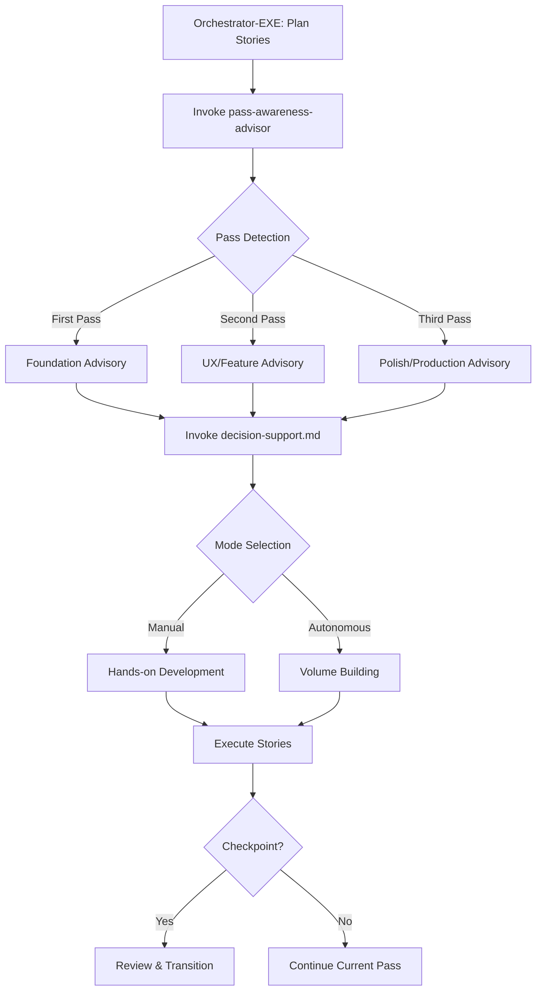

# Pass Awareness Advisor

**Isolation Level**: Orchestrator-EXE only
**Invocation**: Direct (not event-driven)
**Purpose**: Provides context-aware advisory guidance based on development pass phase

## Overview

The Pass Awareness Advisor is an intelligence layer that helps orchestrator-exe understand WHERE the project is in the development lifecycle and WHAT approaches are appropriate for that phase. This skill provides soft recommendations and contextual nudges—it's an advisor, not a dictator.

**Core Philosophy:**
- Advisory messages, not commands
- Soft suggestions based on pass context
- Natural checkpoint detection
- Complements decision-support.md (which handles manual vs autonomous mode selection)
- Works alongside pass-orchestration.md (which handles event-driven transitions in BMAD workflows)

## Three-Pass Development Paradigm

### First Pass: "Backend-First (Get It Working)"
**Goal:** Build end-to-end basic functional structure for a working prototype as quickly as possible

**Characteristics:**
- Manual control recommended (high touch, iterative)
- Focus on core functionality, not polish
- Minimal markup, basic structure
- Rapid prototyping to validate concept
- End-to-end connectivity over perfection

**Advisory Examples:**
- "First pass detected - recommend manual control for iterative development"
- "Keep implementation minimal - we're building the foundation, not the facade"
- "Focus on end-to-end connectivity before adding features"

### Second Pass: "Component Integration (Make It Beautiful)"
**Goal:** Make it look good and behave like the intended user experience

**Characteristics:**
- Add UX improvements and visual polish
- Integrate additional functionality and features
- Refine user interactions and flows
- Enhance frontend components
- Make it behave well, not just work

**Advisory Examples:**
- "Second pass context - consider UX refinements and feature enhancements"
- "Time to make it beautiful - frontend and interaction improvements recommended"
- "Build on the working foundation with user-facing improvements"

### Third Pass: "Debug & Polish (Production Ready)"
**Goal:** Production-ready system that fully delivers on the value proposition

**Characteristics:**
- Debug and fix issues
- Add final features for completeness
- Production hardening (error handling, edge cases)
- Performance optimization
- Deliver on full value proposition

**Advisory Examples:**
- "Third pass - focus on production readiness and value delivery"
- "Polish phase - address edge cases, optimize, and finalize"
- "Final features and debugging to complete the value proposition"

## Invocation Pattern

```javascript
// Orchestrator-EXE invokes directly
const passAdvice = await invoke('pass-awareness-advisor', {
  context: 'checkpoint_check' | 'story_planning' | 'transition_guidance',
  current_state: executionStatus // from .system/execution-status.yaml
})
```

## Capabilities

### 1. Pass Detection
Determines current pass based on:
- `.system/execution-status.yaml` phase tracking
- Story completion patterns
- Epic progression state
- Manual pass indicators in sprint status

### 2. Checkpoint Detection
Identifies natural transition points:
- First pass complete (all stories have basic functionality)
- Epic completion (natural review point)
- Pass transition triggers (moving from 1st → 2nd, 2nd → 3rd)
- Critical milestones reached

### 3. Context-Aware Advisory Messages
Generates soft recommendations based on:
- Current pass (1st/2nd/3rd)
- Work type (new feature, bug fix, refactor)
- Project state (early, mid, late)
- Recent activity patterns

### 4. Transition Recommendations
Suggests when to consider moving between passes:
- "First pass appears complete - checkpoint recommended before second pass"
- "Consider transitioning to polish phase - core features implemented"
- NOT enforced - suggestions only

### 5. Phase-Appropriate Guidance
Provides nudges aligned with current pass:
- First pass: "Keep it simple", "Focus on connectivity", "Manual control recommended"
- Second pass: "Time for UX", "Feature enhancement phase", "Make it beautiful"
- Third pass: "Production hardening", "Edge cases", "Final polish"

## Usage Examples

### Example 1: Story Planning Advisory

**Input Context:**
```yaml
pass: first
epic: user-authentication
stories_completed: 2
stories_total: 8
```

**Advisory Output:**
```markdown
📍 **Pass Context:** First Pass - Building Foundation

**Recommended Approach:**
- Manual control for iterative development
- Focus on end-to-end auth flow (login → dashboard)
- Keep markup minimal - basic HTML/components
- Validate core functionality before adding features

**Advisory:** You're in the foundation-building phase. Aim for a working prototype
that demonstrates the complete authentication flow. Polish and UX improvements
can wait for second pass.
```

### Example 2: Checkpoint Detection

**Input Context:**
```yaml
pass: first
epic: user-authentication
first_pass_stories_complete: 8
second_pass_stories_complete: 0
recent_activity: story completion spike
```

**Advisory Output:**
```markdown
🏁 **Checkpoint Detected:** First Pass Complete

**Transition Recommendation:**
All first-pass stories for the user-authentication epic are complete. This is
a natural checkpoint to:
1. Review working prototype end-to-end
2. Validate core functionality meets requirements
3. Consider transitioning to second pass (UX & feature enhancement)

**Next Steps (Suggested):**
- Manual testing of complete auth flow
- Checkpoint review with team/stakeholder
- Begin second-pass planning for UX improvements
```

### Example 3: Mid-Work Advisory

**Input Context:**
```yaml
pass: second
current_story: enhance-login-ui
work_type: feature_enhancement
```

**Advisory Output:**
```markdown
🎨 **Pass Context:** Second Pass - UX & Features

**Current Focus:** Making it beautiful and feature-rich

**Advisory for this story:**
- Build on the working first-pass foundation
- Focus on user experience and visual polish
- Add nice-to-have features that enhance usability
- Consider autonomous mode if design is clear

**Reminder:** Core functionality exists - enhance it, don't rebuild it.
```

### Example 4: Volume/Speed Consideration

**Input Context:**
```yaml
pass: second
operator_signal: "frustrated with speed"
stories_pending: 12
criteria_clarity: high
```

**Advisory Output:**
```markdown
⚡ **Speed Advisory:** High-Volume Autonomous Mode Recommended

**Context:** Second pass with clear criteria and volume requirements

**Recommendation:**
- Goals appear clear and well-defined
- Low risk of misinterpretation
- Consider autonomous mode for pending stories
- Let the system build volume while you focus on review/direction

**Rationale:** When operators need speed and goals are obvious, autonomous
systems can deliver volume. You can course-correct during review cycles.
```

## Integration Points

### Reads:
- `.system/execution-status.yaml` - Current phase/pass tracking
- `docs/sprint-artifacts/sprint-status.yaml` - Story completion state
- `.system/parallel-work/*.yaml` - Active work context
- Epic files (`docs/epics/*.md`) - Epic-level progress

### Writes:
- Returns advisory messages (string/markdown) to orchestrator-exe
- No direct file modifications
- All output is advisory, consumed by orchestrator-exe for decision-making

### Invokes:
- None - pure advisory skill (reads state, returns recommendations)

### Complements:
- **decision-support.md** - Provides pass context to inform manual vs autonomous decisions
- **pass-orchestration.md** - Event-driven skill handles autonomous transitions; this skill provides manual advisory
- **terminal-prompt-generator.md** - Pass-aware prompts can reference these advisories

## Decision Support Integration

Pass Awareness Advisor provides **context** (where we are), which complements decision-support.md's **mode selection** (manual vs autonomous):

```markdown
Pass Awareness:     "You're in first pass - foundation building"
Decision Support:   "Use manual mode - criteria unclear, high touch needed"
Combined Guidance:  "First pass + unclear criteria = manual iterative development"

Pass Awareness:     "Second pass - UX enhancement phase"
Decision Support:   "Autonomous mode OK - clear criteria, low risk, need volume"
Combined Guidance:  "Second pass + clear UX spec = autonomous for speed"
```

## Isolation Rules

### CRITICAL: Orchestrator-EXE Only
- This skill is isolated to orchestrator-exe domain
- NOT invoked by BMAD agents (dev, pm, architect, etc.)
- NOT event-driven (direct invocation only)

### Read-Only for BMAD Files
- Read `.system/execution-status.yaml` (status only)
- Read sprint/epic files (analysis only)
- No modifications to BMAD-managed files

### Advisory Only
- Returns recommendations, not commands
- Orchestrator-exe decides whether to follow advice
- No enforcement mechanisms
- Soft guidance, not rigid rules

### Complement, Don't Conflict
- Works alongside pass-orchestration.md (event-driven)
- Enhances decision-support.md (mode selection)
- Doesn't override or replace existing systems

## Conversation Patterns

### Pattern 1: Planning Advisory
```
Orchestrator-EXE: "I'm planning the next batch of stories. What pass context should I consider?"

Pass Awareness Advisor: "You're in first pass, 3 of 10 stories complete. Recommend
manual control for remaining foundation stories. Focus on end-to-end connectivity
over polish. Checkpoint recommended after story #10 before transitioning to second pass."
```

### Pattern 2: Transition Guidance
```
Orchestrator-EXE: "All first-pass stories are done. What's next?"

Pass Awareness Advisor: "Checkpoint detected - first pass complete! This is a natural
review point. Suggested next steps: (1) Test end-to-end prototype, (2) Validate
requirements met, (3) Begin second-pass planning for UX improvements. Ready to
transition when you are."
```

### Pattern 3: Mode Clarification
```
Orchestrator-EXE: "Should I use manual or autonomous for story #15?"

Pass Awareness Advisor: "Pass context: Second pass - UX enhancement. If design specs
are clear, autonomous mode can deliver volume. If UX needs iteration, manual mode
for better control. Decision-support.md can help with mode selection based on
criteria clarity."

[Orchestrator-EXE then consults decision-support.md for final mode decision]
```

### Pattern 4: Frustration Response
```
Orchestrator-EXE: "Operator signals: 'This is taking too long, just build it.'"

Pass Awareness Advisor: "Volume signal detected. If goals are clear and obvious,
this suggests autonomous mode is appropriate - let the system build while you
review. High speed/volume needs typically indicate well-defined objectives.
Consider batching stories in autonomous mode for throughput."
```

## Best Practices

### For Orchestrator-EXE
1. **Consult early** - Check pass context before planning story batches
2. **Use with decision-support.md** - Combine pass awareness + mode selection
3. **Respect checkpoints** - Natural transition points are valuable review moments
4. **Don't be rigid** - Advisory guidance, not strict rules
5. **Combine signals** - Pass context + operator signals + criteria clarity = informed decisions

### For System Design
1. **Keep it advisory** - Suggestions, not commands
2. **Natural language** - Human-readable guidance
3. **Context-sensitive** - Different advice for different passes
4. **Complement, don't duplicate** - Works with existing skills
5. **Operator-friendly** - Helps humans make better decisions, doesn't replace them

## Example Integration Flow



## Summary

Pass Awareness Advisor makes orchestrator-exe intelligent about development phases without being bossy. It provides:
- **Context** about where you are (first/second/third pass)
- **Guidance** about what's appropriate for that phase
- **Recommendations** for transitions and checkpoints
- **Advisory support** for decision-support.md mode selection

Think of it as an experienced tech lead giving friendly advice: "Hey, you're in the foundation phase, probably want to keep things manual and simple right now. We can polish it later." Not a project manager barking orders.
